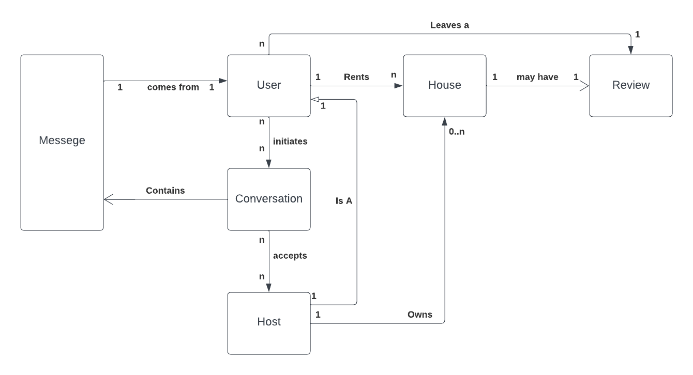
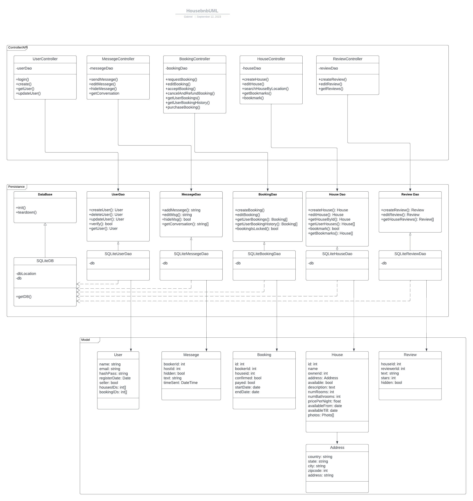

# HouseBnB

## Mission Statement(Generated By CHATGPT)

Empowering Home Seekers and Hosts, One Stay at a Time!

Overview:
Housebnb is a visionary online platform that redefines the way people find, rent, and offer homes. With a commitment to creating unforgettable experiences, Housebnb brings together home seekers and hosts, fostering connections and facilitating seamless transactions. Our platform aims to be the go-to destination for anyone looking to explore the world, find a temporary retreat, or unlock the full potential of their properties, all while promoting easy communication beetween home seekers and hosts.

Mission:

- Our mission is to provide a trusted, user-friendly, and inclusive platform that empowers individuals to discover the perfect home for their needs or to unlock the earning potential of their properties. We are committed to:
- Enriching Lives: We aim to enrich the lives of both home seekers and hosts by offering diverse, inspiring, and affordable home-sharing experiences worldwide, underpinned by meaningful communication.
- Building Community: Housebnb fosters a sense of belonging and community among travelers and hosts, encouraging cultural exchange, understanding, and friendship through effective communication.
- Ensuring Trust and Safety: We prioritize the safety and security of our users, implementing robust verification processes and support systems to create a trustworthy environment while promoting open and transparent communication.
- Innovation and Sustainability: Housebnb embraces innovation and sustainability, continuously exploring new ways to minimize our environmental footprint and improve the well-being of our communities, always with open channels of communication.

Key Values:

- Empathy: We listen, understand, and cater to the unique needs of our users, both hosts and guests, fostering empathetic communication.
- Diversity and Inclusion: We celebrate the diversity of people and homes, striving for an inclusive platform where everyone feels welcome and can communicate freely.
- Reliability: We provide a seamless, reliable, and consistent experience, ensuring that every stay is exceptional, backed by reliable communication channels.
- Responsibility: We are responsible stewards of the communities we serve and the planet we inhabit, communicating our commitment to sustainability.

Impact:
Housebnb aims to create a profound impact by transforming the way people travel, connect, and experience the world through meaningful communication. We aspire to:

- Empower Hosts: Enable homeowners to unlock their property's full potential and improve their financial well-being, while enhancing their communication skills.
- Facilitate Exploration: Inspire travelers to explore the world and make meaningful connections through open and effective communication.
- Foster Mutual Respect: Promote cultural exchange and understanding between hosts and guests, breaking down barriers through respectful and transparent communication.

Housebnb is not just a website; it's a movement that redefines hospitality, connectivity, and communication. Join us on this exciting journey as we reshape the way the world experiences home away from home, one meaningful conversation at a time.

## Domain Model

## Project Requirements

### Acceptence Criteria

Users:

- Can create Users
- Can delete Users
- Users Have Username, Password, email
- can login

Booking:

- Logged in user can book between 2 dates when the house is available
- user can edit booking before payment
- A user can cancel their booking before confirmation and payment
- After confirmation and payment the booking is locked and cant be edited

Reviews:

- Users can leave a review on a House they have booked
- Users can leave zero to five stars with their review

Houses:

- A user can add their house to be lived in
- A house has an owner, address, name, description, a price, and photos
- A house can be made available or unavailable by the owner
- A house can edit their house
- If a house is available it can have a time frame that it is available for
- An owner gets to confirm first if they would like someone to live in their home
- A user can bookmark homes

Messaging:

- A user can initiate a conversation with the owner of a house
- A user and an owner can comminicate with eachother once they have startd a conversation
- A messege can be deleted(hidden) or edited by the messege sender
- A user can see their message history in each conversation

## Backend UML

## Database

For the database I am using SQLite3 but I want it to be easy to swap out. However I change out my database I will still want it to be normalized.

I first can create tables from what my most basic entities are from my uml

Users(
    id INT PRIMARY KEY,
    firstname VARCHAR(32),
    lastname VARCHAR(32),
    **email VARCHAR(32)**,
    username VARCHAR(32),
    **hashPass VARCHAR(64)**,
    registerDate DATE)

Houses(
    id INT PRIMARY KEY,
    ownerId INT FOREIGN KEY,
    name VARCHAR(32),
    **address Address**,
    available BOOLEAN,
    description TEXT,
    rooms INTEGER,
    bathrooms INTEGER,
    price FLOAT(10,2),
    from DATE,
    untill DATE)

HousePhotos(
    id INT NOT NULL PRIMARY KEY
    houseid INT NOT NULL FOREIGN KEY REFERENCES Houses(id),
    photo BLOB NOT NULL)

Booking(
    id INT NOT NULL PRIMARY KEY,
    bookerId INT NOT NULL FOREIGN KEY REFERENCES Users(id),
    houseId INT NOT NULL FOREIGN KEY REFERENCES Houses(id),
    confirmed BOOLEAN NOT NULL DEFAULT FALSE,
    paid BOOLEAN NOT NULL DEFAULT FALSE,
    from NOT NULL DATE,
    untill DATE NOT NULL)

Messege(
    id INT NOT NULL PRIMARY KEY,
    fromId INT NOT NULL FOREIGN KEY REFERENCES Users(id),
    toId INT NOT NULL FOREIGN KEY REFERENCES Users(id),
    text Text NOT NULL,
    hidden BOOLEAN NOT NULL,
    timeSent DATETIME NOT NULL)

Reviews(
    houseId INT NOT NULL FOREIGN KEY REFERENCES Houses(id),
    reviewerId INT NOT NULL FOREIGN KEY REFERENCES Users(id),
    text TEXT NOT NULL,
    stars float(1, 2) NOT NULL CHECK (stars >= 0 AND stars <= 5),
    CONSTRAINT REVIEWS_PK PRIMARY KEY (houseId, reviewerId))
